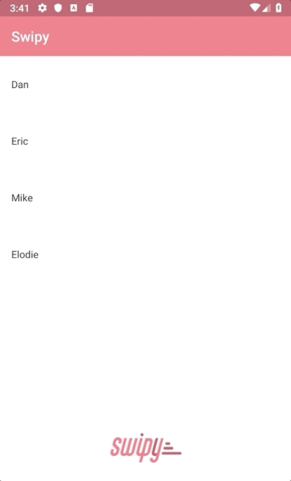

 

**Swipy is a simple and customizable solution to create  "swipable" views**



## Binaries
Coming soon

## Sample

After defining the layout for the swipable view and the actions, you need to use the `addDrag` function to define which way they are swipable. 

```
swipeLayout.addDrag(LEFT_EDGE, swipeLayout.findViewById(R.id.swipe_left_action))
swipeLayout.addDrag(RIGHT_EDGE, swipeLayout.findViewById(R.id.swipe_right_action))
```

```
<com.dotloop.swipy.SwipeLayout
    android:id="@+id/swipe_layout"
    android:layout_width="match_parent"
    android:layout_height="@dimen/list_cell_height"
    xmlns:android="http://schemas.android.com/apk/res/android"
    xmlns:app="http://schemas.android.com/apk/res-auto"
    xmlns:tools="http://schemas.android.com/tools"
    >
    <LinearLayout
        android:id="@+id/swipe_left_action"
        android:layout_width="160dp"
        android:layout_height="match_parent"
        android:weightSum="1"
        >
        <TextView
            android:id="@+id/action1"
            android:layout_width="70dp"
            android:layout_height="50dp"
            android:text="Action 1"
            />
    </LinearLayout>
    <LinearLayout
        android:id="@+id/swipe_right_action"
        android:layout_width="wrap_content"
        android:layout_height="match_parent"
        >

        <ImageView
            android:id="@+id/action2"
            android:layout_width="70dp"
            android:layout_height="50dp"
            android:text="Action 2"
            />
    </LinearLayout>
    <TextView
        android:id="@+id/swipable)view"
        android:layout_width="match_parent"
        android:layout_height="match_parent"
        android:background="@android:color/white"
        tools:text="Swipe me"
        />

</com.dotloop.swipy.SwipeLayout>
```

## License
Copyright 2019 dotloop, Zillow Group

Licensed under the Apache License, Version 2.0 (the "License");
you may not use this file except in compliance with the License.
You may obtain a copy of the License at

   http://www.apache.org/licenses/LICENSE-2.0

Unless required by applicable law or agreed to in writing, software
distributed under the License is distributed on an "AS IS" BASIS,
WITHOUT WARRANTIES OR CONDITIONS OF ANY KIND, either express or implied.
See the License for the specific language governing permissions and
limitations under the License.
